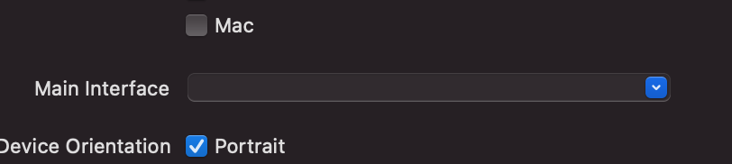
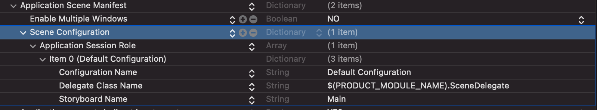
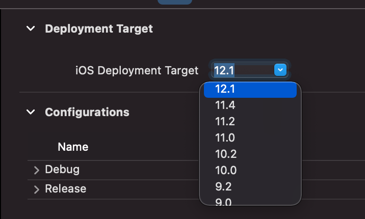

# Deployment Target 12.x で Main.storyboard を削除する。

## 環境

Xcode 12.5(12E262)

## Main.storyboard を削除

1. Main.storyboard を削除。
2. `ProjectFile` > `TARGETS` > `Main interface` から Main を空にする
3. `Info.plist` > `Application Scene Manifest` > `Scene Configuration` > `Application Session Role` > `Storyboard name` から Main を削除

   
   

## rootViewController を設定

`SceneDelegate.swift`に以下を追加する。

```diff swift:SceneDelegate.swift
func scene(_ scene: UIScene, willConnectTo session: UISceneSession, options connectionOptions: UIScene.ConnectionOptions) {
    guard let windowScene = (scene as? UIWindowScene) else { return }
+   let window = UIWindow(windowScene: windowScene)
+   window.rootViewController = ViewController()
+   self.window = window
+   window.makeKeyAndVisible()
}
```

## Deployment Target を変更

`ProjectFile` > `PROJECT` > `Deployment Target` > `iOS Deployment Target` で 12.1 などを選択。



## SceneDelegate などを iOS13 以上利用可にする

SceneDelegate は iOS13 以上で利用可能のため attribute を追加する。  
(https://developer.apple.com/documentation/uikit/uiscenedelegate)

```diff swift:SceneDelegate.swift
+ @available(iOS 13.0, *)
class SceneDelegate: UIResponder, UIWindowSceneDelegate {
```

`AppDelegate.swift`の以下 UISceneSessionLifeCycle にも attribute を追加する。

```diff swift:AppDelegate.swift
+ @available(iOS 13.0, *)
func application(_ application: UIApplication, configurationForConnecting connectingSceneSession: UISceneSession, options: UIScene.ConnectionOptions) -> UISceneConfiguration {
    return UISceneConfiguration(name: "Default Configuration", sessionRole: connectingSceneSession.role)
}

+ @available(iOS 13.0, *)
func application(_ application: UIApplication, didDiscardSceneSessions sceneSessions: Set<UISceneSession>) {}
```

また、rootViewController を SceneDelegate でしか設定できていないので、`AppDelegate.swift` も以下で修正する。

```diff swift:AppDelegate.swift
+ var window: UIWindow?

func application(_ application: UIApplication, didFinishLaunchingWithOptions launchOptions: [UIApplication.LaunchOptionsKey: Any]?) -> Bool {
+    window = UIWindow(frame: UIScreen.main.bounds)
+    window?.rootViewController = ViewController()
+    window?.makeKeyAndVisible()
    return true
}
```
